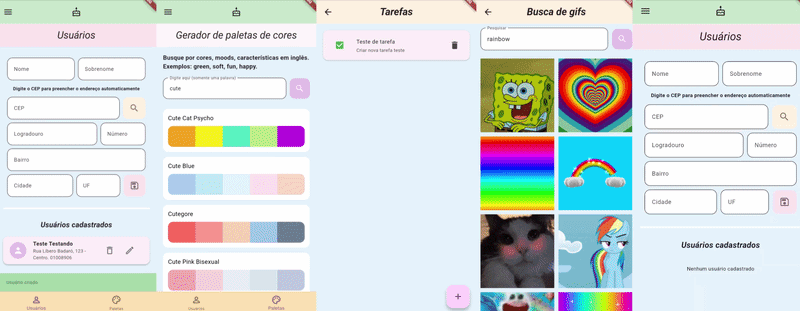

# To-Do & API Explorer

 


Um aplicativo mobile em Flutter focado em implementar gerenciamento de estado, persistência de dados local (CRUD) e consumo de múltiplas APIs REST de terceiros.

## 🔴 Sobre
Este aplicativo foi desenvolvido durante as aulas da disciplina de Tecnologias de Desenvolvimento Mobile. Seu objetivo é consolidar operações assíncronas, tratamento de requisições HTTP, modelagem de banco de dados local e consumação de APIs externas em um ambiente mobile Android, servindo como projeto de aprendizado da linguagem Dart, por meio do kit de desenvolvimento (SDK) Flutter.



## 🟠 Funcionalidades

O aplicativo é dividido em quatro módulos principais, cada um focado em implementar uma funcionalidade diferente:

**1. Gerenciamento de tarefas (to-do list)**
- [x] CRUD completo com armazenamento local via [SQLite](https://docs.flutter.dev/cookbook/persistence/sqlite), aplicando padrão DAO (Data Access Object);
- [x] Atualização de status dinâmico (marcar como pendente/concluída) via checkbox;
- [x] Atualização automática quando o usuário retorna da tela de criação/edição;
- [x] Dialog de confirmação para prevenir a exclusão acidental de registros.

**2. Perfil de usuários ([ViaCEP API](https://viacep.com.br/))**
- [x] CRUD de dados de usuários com banco de dados local;
- [x] Requisição HTTP assíncrona para buscar endereços via CEP, com preenchimento automático do formulário;
- [x] Validação nativa de formulários (tamanho e preenchimento dos inputs de texto e numéricos).

**3. Buscador de GIFs ([Giphy API](https://developers.giphy.com/docs/api/))**
- [x] Consumo da API do Giphy (com Beta Key) para listar os GIFs em alta ao abrir a tela;
- [x] Sistema de busca por palavras-chave com exibição em GridView;
- [x] Paginação customizada com botão "Mostrar mais" que controla dinamicamente o offset da requisição para carregar novos resultados sem perder os anteriores;
- [x] Tela de detalhes passando os dados do GIF via construtor para renderização em tela cheia.

**4. Gerador de paletas ([ColorMagic API](https://colormagic.app/api/))**
- [x] Integração HTTP para buscar paletas de cores baseadas em palavras-chave (ex: "soft", "happy", "green");
- [x] Conversão dinâmica de cores em hexadecimal retornados pela API (String) para objetos Color nativos do Flutter;
- [x] Tratamento de erros de conexão e exibição de loading visual durante a requisição.

## 🟡 Execução

**Pré-requisitos:** SDK do Flutter instalado.

```bash
# Clone o repositório
git clone https://github.com/barbarastella/pm-todolist.git

# Acesse a pasta
cd pm-todolist

# Instale as dependências
flutter pub get

# Rode o aplicativo
flutter run
```
**OBSERVAÇÃO**: A Beta Key do Giphy foi disponibilizada no repositório, mas uma Production Key deve ser inserida nas variáveis de ambiente via comando `flutter run --dart-define=NOME_DA_VAR=https://uri-da-api.com`  ou pelo pacote gerenciador `flutter_dotenv`.

## 🟢 Contato
<p align="left">
  Em caso de dúvidas ou comentários, entre em contato:&nbsp;
  
  <a href="https://www.linkedin.com/in/barbara-wehrmann/" title="LinkedIn">
    
  </a>
  <a href="mailto:barbarastellaw@gmail.com" title="Gmail">
    
  </a>
  <a href="https://www.instagram.com/barbarastellaw" title="Instagram">
    
  </a>
</p>